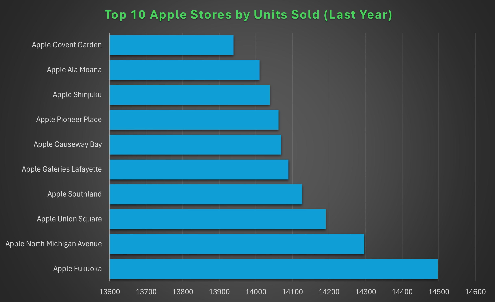
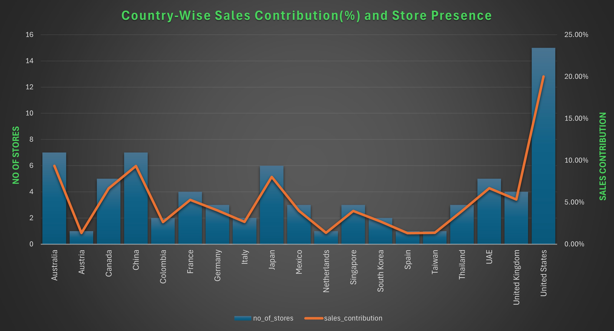
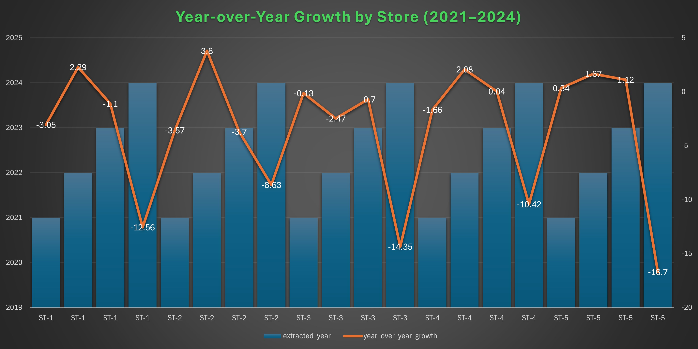

# Apple-Store-Sales-SQL-Analysis
## Introduction
This project analyzes Apple retail sales and warranty claims using PostgreSQL. The goal is to uncover insights about store performance, country contributions, product claims, and sales growth over time. By combining SQL queries with business-focused questions, I transformed raw data into actionable insights.

[View the SQL Queries](apple_sale_analysis.sql)
## Background
Apple operates retail stores worldwide, and analyzing sales and warranty claims provides valuable information on product performance, customer behavior, and market contributions. This project simulates such an environment with a dataset of sales, stores, products, and warranty claims.

### The analysis answers key questions like:

1. Which stores and countries contribute most to overall sales?
2. What are the top-selling products and categories?
3. How do warranty claims compare across price ranges?
4. What are the sales growth patterns over time?
## Tools I Used
- **PostgreSQL** → For database management and writing SQL queries 
- **Excel** → For creating charts and quick visual summaries  
- **GitHub** → To share, document, and version-control the project  
- **ChatGPT** → For drafting insights and speeding up analysis 
## The Analysis
The analysis dives into specific business questions such as which stores generate the highest sales, which countries contribute most to revenue, and how warranty claims compare across products and regions. Each query is paired with results, insights, and where useful, a visualization. This approach not only highlights patterns in sales and claims but also uncovers performance differences between markets, helping to link raw SQL outputs with real business understanding.
### 1. Distribution of Warranty Claims across different Repair Statuses
```sql
select repair_status, count(claim_id) as Total_claims
from warranty
group by repair_status;
```
The distribution of claims across statuses is fairly balanced, showing consistent workflow handling:
- **In Progress:** (7,611) has the highest count, suggesting a backlog or high current demand for repairs.
- **Completed:** claims (7,466) are slightly lower than “In Progress,” indicating steady but slightly lagging resolution.
- **Rejected:** claims are also significant (7,357), highlighting either strict warranty policies or customer misuse/product issues.

| Repair Status | Total Claims |
| ------------- | ------------ |
| Rejected      | 7,357        |
| Completed     | 7,466        |
| In Progress   | 7,611        |
| Pending       | 7,566        |

*Warranty Claim Processing Status Summary*
### 2. Top 10 Stores with Highest Total Units Sold in the Last Year
```sql
select s.store_id, st.store_name, sum(s.quantity) as total_units_sold
from sales as s
	join stores as st
	on s.store_id = st.store_id
where sale_date > '2023-12-31'
group by s.store_id, st.store_name
order by total_units_sold desc
limit 10;
```
- Apple Fukuoka (Japan) leads with 14,497 units sold.
- Close competition from North Michigan Avenue (Chicago) & Union Square (San Francisco).
- Strong performance across Asia, North America, and Europe (Japan, USA, France, UK).
- Narrow gap (~560 units) between #1 and #10 → shows consistent sales among top stores.
- Top stores are mainly in flagship, premium shopping locations.



*The bar graph shows the top 10 Apple stores globally, with Apple Fukuoka, North Michigan Avenue, and Union Square leading in total units sold*
### 3. Products Generate the Highest Total Sales Revenue
```sql
select p.product_id, p.product_name, sum(s.quantity * p.price) as total_sales
from sales as s
	join products as p on p.product_id = s.product_id
group by p.product_id, p.product_name
order by total_sales desc;
```
- **Apple Music:** leads with $125M+ sales, showing the strength of Apple’s services in addition to hardware.
- **iPads:** dominate with multiple models in the Top 10, reflecting their versatility across education, business, and entertainment.
- **MacBook Air (Retina & M1):** both rank highly, showing the ongoing demand for lightweight laptops across generations.
- **Wearables & accessories (AirPods, Beats Fit Pro):** also make the list, highlighting the importance of the ecosystem beyond flagship devices.

| Rank | Product Name               | Total Sales |
| ---- | -------------------------- | ----------- |
| 1    | Apple Music                | 125,453,460 |
| 2    | iMac 27-inch               | 124,006,372 |
| 3    | iPad mini (5th Generation) | 123,951,136 |
| 4    | iPad (9th Generation)      | 123,950,553 |
| 5    | Beats Fit Pro              | 118,449,990 |
| 6    | MacBook Air (Retina)       | 118,110,109 |
| 7    | AirPods (3rd Generation)   | 118,075,884 |
| 8    | iPad Pro (M2)              | 116,029,518 |
| 9    | iPad Pro 11-inch           | 114,056,448 |
| 10   | MacBook Air (M1)           | 113,204,453 |

*Top 10 Best-Selling Apple Products*
### 4. Countries Contribution to Overall Sales, with No of Stores they have
```sql
select st.country, count(distinct st.store_id) as no_of_stores,
sum(s.quantity * p.price) as country_sales,
	round(sum(s.quantity * p.price)::numeric/
		(select sum(s.quantity * p.price)::numeric
		from sales as s join products as p on s.product_id = p.product_id) * 100,
	2) || '%' as sales_contribution
from sales as s 
	join stores as st on st.store_id = s.store_id
	join products as p on s.product_id = p.product_id
group by st.country
order by no_of_stores desc;
```
- **United States:** dominates with 20.03% of global sales from 15 stores, making it the largest contributor by far.
- **Australia:** (9.36%) and China (9.33%) follow closely, despite each having only 7 stores, showing high productivity per store.
- **Japan:** (8.04%) also contributes strongly with just 6 stores.
- **European countries:** like the UK (5.33%), France (5.28%), and Germany (4.04%) maintain solid contributions with fewer stores.
- **Several countries:** with only 1–3 stores (e.g., Singapore, Thailand, Taiwan, Netherlands, Spain) still contribute meaningfully, proving the
    strength of Apple’s flagship locations.



*This graph highlights the global distribution of stores and their respective sales contributions, showing the United States as the top performer*
### 5. Chance of Receiving Warranty Claims after Purchase for each Country
```sql
with risk_of_getting_claim as
(
	select st.country, sum(s.quantity) as totla_units_sold, count(w.claim_id) No_of_Claims,
		round((count(w.claim_id)::numeric/
		sum(s.quantity)::numeric * 100), 2) || '%' as percentage_of_getting_claim
	from sales as s
		join warranty as w on s.sale_id = w.sale_id
		join stores as st on st.store_id = s.store_id
	group by st.country
	order by percentage_of_getting_claim desc
)
select * from risk_of_getting_claim;
```
- **Taiwan, Netherlands, Austria, and Spain:** have the highest claim rates (~18.5–19%), despite lower total units sold.
- **The United States:** sold the most units (33K+) but had a slightly lower claim rate (18.3%), showing better reliability at scale.
- **The UK, Canada, and UAE:** are mid-volume sellers but still have above-average claim percentages (~18.4–18.5%).
- **South Korea:** had the lowest claim percentage (17.87%), indicating stronger product reliability.
- **Overall:** claim percentages are closely clustered (17.8%–19%), suggesting a consistent global warranty claim pattern across markets.


| Country         | Total Units Sold | No. of Claims | % of Getting Claim |
|-----------------|------------------|---------------|---------------------|
| Taiwan          | 2,211            | 419           | 18.95%             |
| Netherlands     | 2,279            | 428           | 18.78%             |
| Austria         | 2,399            | 448           | 18.67%             |
| Spain           | 1,833            | 340           | 18.55%             |
| United Kingdom  | 8,779            | 1,624         | 18.50%             |
| Canada          | 11,007           | 2,035         | 18.49%             |
| UAE             | 11,089           | 2,046         | 18.45%             |
| Germany         | 6,522            | 1,201         | 18.41%             |
| United States   | 33,257           | 6,086         | 18.30%             |
| Colombia        | 4,122            | 752           | 18.24%             |
| Singapore       | 6,588            | 1,198         | 18.18%             |
| Thailand        | 6,390            | 1,159         | 18.14%             |
| Italy           | 4,159            | 754           | 18.13%             |
| Australia       | 15,614           | 2,827         | 18.11%             |
| China           | 14,997           | 2,713         | 18.09%             |
| Mexico          | 6,559            | 1,186         | 18.08%             |
| France          | 8,766            | 1,585         | 18.08%             |
| Japan           | 13,411           | 2,417         | 18.02%             |
| South Korea     | 4,377            | 782           | 17.87%             |

*Claim Probability Across Countries*
### 6. Categories Contribution to Total Revenue
```sql
select c.category_name, count(distinct p.product_id) as no_of_products,
sum(s.quantity * p.price) as category_sales,
	round(sum(s.quantity * p.price)::numeric/
		(select sum(s.quantity * p.price)::numeric
		from sales as s join products as p on s.product_id = p.product_id) * 100,
	2) || '%' as sales_contribution
from sales as s 
	join products as p on s.product_id = p.product_id
	join category as c on c.category_id = p.category_id
group by c.category_name
order by no_of_products desc;
```
- Tablets lead with the highest sales contribution (15.46%), followed closely by Accessories (15.04%) and Smartphones (14.03%).
- Desktops (8.73%) and Subscription Services (5.98%) contribute moderately, indicating niche demand.
- Streaming Devices (3.11%) and Smart Speakers (1.56%) have the lowest share, showing limited revenue impact compared to other categories.
- Overall, the top 3 categories (Tablet, Accessories, Smartphone) contribute nearly 45% of total sales, highlighting where the business derives most of its          revenue.


| Category Name         | No. of Products | Category Sales | Sales Contribution |
|-----------------------|-----------------|----------------|---------------------|
| Accessories           | 14              | 927,115,953    | 15.04%             |
| Smartphone            | 13              | 865,147,932    | 14.03%             |
| Audio                 | 11              | 794,980,579    | 12.89%             |
| Tablet                | 10              | 953,443,623    | 15.46%             |
| Laptop                | 10              | 763,382,551    | 12.38%             |
| Desktop               | 10              | 538,481,345    | 8.73%              |
| Wearable              | 9               | 667,537,447    | 10.83%             |
| Subscription Service  | 7               | 368,463,489    | 5.98%              |
| Streaming Device      | 3               | 191,622,603    | 3.11%              |
| Smart Speaker         | 2               | 96,117,508     | 1.56%              |

*Category Revenue Breakdown*
### 7. Year-by-Year Growth Ratio for each Store
```sql
WITH yearly_sales AS 
(
    SELECT 
    store_id,
    extract(year from s.sale_date) AS extracted_year,
    SUM(p.price * s.quantity)::numeric AS total_sales
    FROM sales as s
		join products as p
		on s.product_id = p.product_id
    GROUP BY store_id, extracted_year
),
growth as
(
	select
    store_id,
    extracted_year,
    total_sales,
    LAG(total_sales) OVER(PARTITION BY store_id ORDER BY extracted_year) AS prev_year_sales
	from yearly_sales
)
select store_id, extracted_year, prev_year_sales, total_sales as current_year_sales,
    ROUND(((total_sales - prev_year_sales)/
	(prev_year_sales)) * 100, 2) AS year_over_year_growth
FROM growth
where prev_year_sales is not null
ORDER BY store_id, extracted_year;
```
-  Most stores experienced consistent decline in 2024, with drops ranging -7% to -22%, showing a broad market slowdown.
-  2021–2023 had mixed performance: some stores grew steadily (e.g., ST-14 +5.15% in 2023) while others declined.
-  Top growth years were seen in 2021–2022 transitions, where many stores had +2% to +6% increases.
-  Biggest losses in 2024: ST-14 (-21.83%), ST-58 (-21.07%), ST-9 (-18.62%), ST-30 (-17.42%).
-  Stores with strong resilience (slower decline in 2024) include ST-40 (-7.40%) and ST-70 (-9.60%).
-  Overall trend: short-term gains (2021–2022) followed by sharp contraction in 2024.



*The graph highlights YoY growth patterns for a sample of 5 stores over 4 years, showcasing revenue fluctuations and performance trends. While only a subset is visualized for clarity, the analysis covers all 75 stores to provide a comprehensive business overview*
## What I Learned
- 🛠️ **SQL Skills**  
  - Writing complex queries using **JOINs**, **subqueries**, and **window functions**  
  - Performing **aggregations** and **comparisons** across time and categories  
  - Using **running totals** and **growth ratios** directly in SQL  
- 📊 **Analysis to Insights**  
  - Translating raw SQL query outputs into **clear business insights**  
  - Identifying **patterns, trends, and performance contributors**  
- 💻 **Project & Portfolio Skills**  
  - Structuring and documenting a project for **GitHub portfolio presentation**  
  - Communicating results with **charts and summaries**  

## Conclusion
### Insights
Through SQL-based analysis, I identified patterns in Apple’s sales and warranty data:

- **United States** dominates sales contribution with **20% share**, far ahead of other countries.  
- **Asia-Pacific markets** (China, Japan, Singapore, Thailand) show **strong growth potential**, highlighting regional expansion opportunities.  
- **Certain product lines** (e.g., iPhones, MacBooks) consistently drive **both high sales and high warranty claims**.   
- Countries with **fewer stores** (e.g., Spain, Taiwan, Austria) still achieve notable sales contributions, indicating strong brand demand.  
- **Cumulative sales trends** reveal steady global growth, with minimal fluctuations year-over-year.    
- **Top stores** (like Apple Fukuoka, Union Square, Covent Garden) perform exceptionally, contributing disproportionately to sales.  
- Data suggests a **shift toward emerging markets** that could reshape future sales distribution.  
## Closing Thoughts
This project was a great exercise in combining SQL technical skills with business storytelling. It highlights how data analysts can turn structured queries into meaningful recommendations for business strategy.
